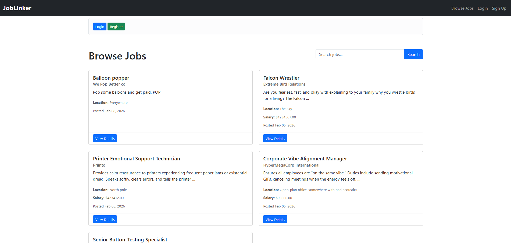
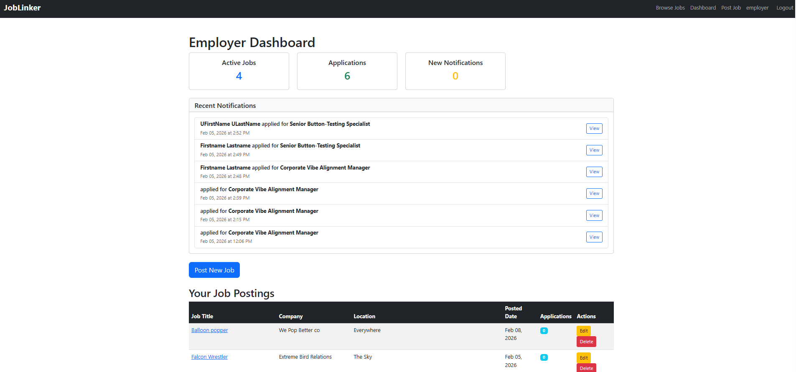
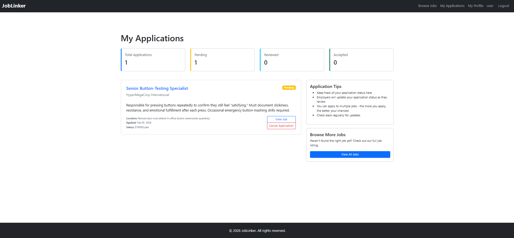
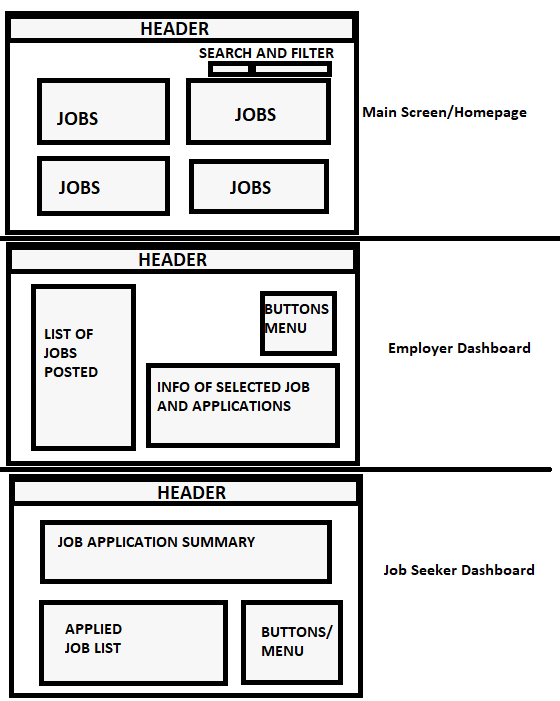

# JobLinker – AI-Augmented Full-Stack Django Application

**Live Site:** https://joblinker-32ea19931b20.herokuapp.com/  
**Repository:** https://github.com/DeanHarland/capstone_project_joblinker-

---

# Project Overview

JobLinker is a full-stack web application built with Django that connects employers and job seekers through a role-based job board platform.

Employers can create and manage job listings, while job seekers can browse listings, submit applications, and manage their applications securely.

This project was developed as an individual Full-Stack Capstone Project for the Code Institute AI-Augmented Full-Stack Bootcamp. It demonstrates competency in:

- UX design and accessibility
- Full-stack Django development
- Role-based authentication and authorization
- Database modelling and CRUD operations
- Testing (manual and automated)
- Secure deployment
- Version control best practices
- Strategic AI-assisted development

---

# Live Application Preview
*Figure 1: JobLinker homepage showing job listings and navigation.*
<details>
<summary> Click to view screenshot </summary>


</details>

*Figure 2: JobLinker Employer dashboard showing job postings and notifications.*
<details>
<summary> Click to view screenshot </summary>


</details>

*Figure 3: JobLinker Jobseeker dashboard showing job applications.*
<details>
<summary> Click to view screenshot </summary>


</details>


# Project Purpose

The purpose of JobLinker is to:

- Provide a secure, role-based job board platform
- Demonstrate scalable, production-ready Django development
- Apply Agile methodology in a real-world project
- Integrate AI tools effectively into a professional development workflow

---

# User Roles & Permissions

| Role | Permissions |
|------|-------------|
| Admin | Full access via Django Admin |
| Employer | Create, edit, delete job listings; review applications |
| Job Seeker | View jobs, apply for jobs, cancel applications |

Access control is enforced both at the view level and within templates to ensure data integrity and security.

---

# UX Design Process (LO1)

## Strategy

Target users:
- Employers seeking to advertise positions
- Job seekers searching and applying for roles

Primary goals:
- Clear navigation
- Simple, intuitive workflows
- Strong separation of user roles
- Secure interaction with data

---

## Scope

Core features were prioritised using user stories:

### Employer
- Create job listings
- Edit/delete own listings
- View applications

### Job Seeker
- Browse job listings
- Apply for jobs
- Cancel applications

### General User
- Register and log in securely
- Receive feedback on actions

All user stories were tracked using GitHub Projects and progressed through To Do → In Progress → Done.

---

## Structure

The information architecture separates:

- Public job listings
- Employer dashboard
- Job seeker dashboard
- Authentication pages

Navigation adapts dynamically based on login state and user role.

---

## Skeleton (Wireframes)

Wireframes were created during initial planning and refined iteratively throughout development. Layout decisions prioritised:

- Clear hierarchy of information
- Prominent action buttons
- Minimal cognitive load
- Distinct dashboards per role

*Figure 4: JobLinker wireframe*
<details> 
<summary>Click to view screenshot </summary>


</details>


---

## Surface (Visual Design)

- Bootstrap grid system used for responsive design
- Clean typography and spacing for readability
- Consistent UI components across the application
- Clear visual feedback using alerts and success messages

---

# Accessibility (LO1.1)

Accessibility was considered throughout development:

- Semantic HTML elements used consistently
- All forms include associated labels
- Server-side validation ensures meaningful error messages
- Colour contrast handled using Bootstrap standards
- Keyboard-accessible navigation
- Responsive design tested across mobile, tablet, and desktop devices

No major accessibility issues were identified during testing.

---

# Features

## Front-End

- Responsive Bootstrap design
- Conditional UI rendering based on user role
- Django messages framework for user feedback
- Clean and consistent layout across devices

## Back-End

- Custom Django models
- Full CRUD functionality
- Role-based access control
- PostgreSQL database integration
- Secure environment variable configuration

---

# Data Model & Object-Oriented Design (LO2 & LO7)

## Custom Models

### Job
- title
- company
- location
- description
- salary
- created_by (ForeignKey → User)

### Application
- job (ForeignKey → Job)
- applicant (ForeignKey → User)
- status
- applied_at

## Relationships

- One employer → Many jobs
- One job → Many applications
- One job seeker → Many applications

Django’s ORM was used to implement object-oriented principles and manage all database relationships securely.

---

# CRUD Functionality (LO2.2)

| Feature | Create | Read | Update | Delete |
|----------|--------|------|--------|--------|
| Jobs | ✅ | ✅ | ✅ | ✅ |
| Applications | ✅ | ✅ | ❌ | ✅ |

CRUD actions are restricted by user role to prevent unauthorised data manipulation.

---

# Forms, Validation & Notifications (LO2.4)

- Django ModelForms implemented for all data entry
- Server-side validation ensures secure input handling
- Clear error and success messages via Django messages framework
- Forms designed for clarity and accessibility

---

# Authentication & Authorization (LO3)

## Authentication

- Django’s built-in authentication system used
- Secure password hashing
- Login, registration, and logout functionality implemented

## Authorization

- `@login_required` decorators protect restricted views
- Ownership checks ensure users can only modify their own records
- Template logic conditionally renders content based on user role
- Unauthorised access redirects users appropriately

Login state is reflected dynamically in navigation and dashboards.

---

# Testing (LO4)

## Automated Testing

Django unit tests were implemented to cover:

- Model creation
- CRUD functionality
- Access control restrictions
- Form validation

Tests were executed using:

```
python manage.py test
```

All core functionality passed automated tests.

---

## Manual Testing

Manual testing covered:

- Registration & login
- Role-based access restrictions
- CRUD functionality
- Notification messages
- Responsive design across device sizes

| Feature | Expected Result | Status |
|----------|----------------|--------|
| User logs in | User logs in | Pass |
| Login state awareness | User's name displayed in header | Pass |
| Role-based permissions | Access/ability restricted appropriately | Pass |
| Employer creates job | Job saved and displayed | Pass |
| Employer edits job | Job changes saved and displayed | Pass |
| Employer deletes job | Job deleted and removed | Pass |
| Job seeker applies | Application recorded | Pass |
| Unauthorized edit attempt | Access denied | Pass |

Manual testing was also done by 2 peer reviewers.

## JavaScript Testing

Minimal custom JavaScript was used. Bootstrap components provide UI behaviour. As no custom JS logic was implemented, separate JS testing was not required.

---

# Validators

## HTML Validation

All HTML templates were tested using the W3C Markup Validation Service.

- Initial minor syntax issues were identified and corrected.
- Final validation returned **zero errors or warnings**.
- Semantic HTML elements were used consistently to improve accessibility, structure, and maintainability.

This ensures compliance with modern web standards and satisfies LO1.1 Front-End Design requirements.

---

## Lighthouse Testing

The deployed application was tested using Google Lighthouse via Chrome DevTools.

Final scores:

- **Performance:** 96  
- **Accessibility:** 100  
- **Best Practices:** 100  
- **SEO:** 90  

No major accessibility issues were detected.

---

## Accessibility Considerations

- All form inputs include associated `<label>` elements.
- Navigation is fully keyboard accessible.
- Bootstrap’s accessible components were used throughout.
- Colour contrast aligns with WCAG standards.
- Responsive design was tested across mobile, tablet, and desktop screen sizes.


---

# Version Control & Secure Code Management (LO5)

## Git Usage

- Regular, incremental commits
- Clear, descriptive commit messages
- Commit history reflects feature development and bug fixes
- GitHub Project Board used for tracking progress

## Security

- `.gitignore` prevents sensitive files from being committed
- All secrets managed via environment variables
- No passwords or API keys stored in repository

---

# Deployment (LO6)

## Hosting

- Application deployed on Heroku
- PostgreSQL database configured for production

## Deployment Process

1. Configure environment variables
2. Set `DEBUG=False`
3. Configure `ALLOWED_HOSTS`
4. Add `Procfile` and runtime configuration
5. Run migrations
6. Collect static files

The deployed version matches local development functionality.

---

## Production Security

- DEBUG disabled
- Secret keys stored securely
- No sensitive data exposed in repository
- Secure database configuration

---

# AI-Assisted Development (LO8)

## Tools Used

- ChatGPT
- GitHub Copilot

## AI Contributions

### Planning
AI assisted with project structure planning and workflow design.

### Code Generation
AI supported generation of boilerplate Django views, forms, and logic.

### Debugging
AI helped diagnose configuration issues, deployment errors, and logic bugs.

### Testing
GitHub Copilot assisted in generating unit tests, which were reviewed and refined manually.

### Optimisation
AI suggestions improved code clarity and development efficiency.

All AI-generated content was reviewed, adapted, and fully understood before integration.

## AI Reflection

AI tools were used strategically throughout the development of JobLinker to improve workflow efficiency and support decision-making.

Initially, ChatGPT assisted in selecting an appropriate project idea, generating a project brief, and creating structured user stories aligned with the marking rubric. These artefacts were then used to guide development planning. 

Using the user stories and rubric, ChatGPT helped create a detailed step-by-step development plan. This plan was incorporated into GitHub Copilot, which assisted in generating boilerplate Django code, forms, and views, as well as providing suggestions during iterative feature development.

After building the base version of the site, GitHub Copilot supported refinement of functionality, including the implementation of a fully functional job seeker workflow. AI contributions were reviewed and adapted to ensure code quality, security, and alignment with project requirements.

Overall, AI tools enhanced productivity, provided structured guidance, and facilitated efficient iteration without replacing manual decision-making or understanding of the codebase.

---

# Technologies Used

- Python
- Django
- PostgreSQL
- HTML5
- CSS3
- Bootstrap
- Git & GitHub
- Heroku
- ChatGPT
- GitHub Copilot

---

# Future Improvements

- Job filtering and search functionality
- Pagination for large job listings
- Email notifications for application updates
- Application status updates by employers
- Enhanced user profile features

---

# Known Limitations

- Employers cannot currently update application status
- No advanced job filtering implemented yet

---

# Acknowledgements

This project was completed as part of the Code Institute AI-Augmented Full-Stack Bootcamp.

It demonstrates full-stack development competency combined with structured AI-assisted workflow integration.

---

# Final Statement

JobLinker satisfies all required Learning Outcomes for the Full-Stack Capstone Project, demonstrating:

- Professional UX design
- Secure role-based authentication
- Structured database modelling
- Full CRUD implementation
- Testing and validation
- Secure deployment practices
- Strategic AI integration
